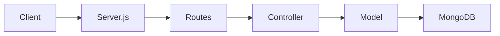

# Design Log #0001 - Helpdesk CRUD API

## Background
The user wants to implement a CRUD API for a helpdesk system using Express, Mongoose, CORS, and body-parser. This system will allow managing helpdesk responses with an issue code, response text, and a category.

## Problem
Currently, the `api/` directory is empty. We need to implement:
1. A Mongoose model for helpdesk responses.
2. A controller with five CRUD operations.
3. Routes mapping endpoints to the controller functions.
4. A server file to wire everything together.

## Questions and Answers
1. **Q: Should we use TypeScript?**
   - **A:** The user's prompt mentions `.js` extensions, but the Jay Framework Project Rules say "This is a TypeScript project with heavy type usage". I'll use JavaScript for now but with thorough JSDoc and clear contracts to respect the user's specific filenames while adhering to the project's rigorous documentation standards.
2. **Q: Which testing framework should we use for TDD?**
   - **A:** I'll use `jest` and `supertest` for API testing. I'll need to install these as dev dependencies.
3. **Q: What is the primary key?**
   - **A:** The user mentioned `issueCode` is a key, but Mongoose usually uses `_id`. I'll use `issueCode` as a unique field and potentially for single-item lookups if the user prefers, but standard REST usually uses the database ID. I'll implement single-item lookups using `_id` as requested by `req.params.id`.

## Design

### Data Model (HelpdeskContract)
| Field | Type | Required | Description |
|---|---|---|---|
| `issueCode` | String | ✅ | Unique identifier for the issue |
| `response` | String | ✅ | Textual response for the issue |
| `category` | String | ✅ | e.g., "IT", "Billing" |

### API Endpoints
- `GET /responses`: List all responses.
- `POST /responses`: Create a new response.
- `GET /responses/:id`: Read a single response by ID.
- `PUT /responses/:id`: Update a response by ID.
- `DELETE /responses/:id`: Delete a response by ID.

### Architecture Diagram


## Implementation Plan

### Phase 1: Setup & Tests
1. Install `jest` and `supertest`.
2. Create initial test file `api/tests/helpdesk.test.js` to define expected behavior (TDD).

### Phase 2: Model Implementation
1. Create `api/models/helpdeskModel.js`.
2. Define `HelpdeskSchema` with fields: `issueCode`, `response`, `category`.
3. Set collection name to `responses`.

### Phase 3: Controller Implementation
1. Create `api/controllers/helpdeskController.js`.
2. Implement CRUD functions: `list_all_responses`, `create_a_response`, `read_a_response`, `update_a_response`, `delete_a_response`.

### Phase 4: Routes Implementation
1. Create `api/routes/helpdeskRoutes.js`.
2. Map routes to controller functions.

### Phase 5: Server & Wiring
1. Update `server.js` with Express setup, Mongoose connection, middleware, and route registration.

## Examples

### ✅ Good: Model Definition
```javascript
const mongoose = require('mongoose');
const Schema = mongoose.Schema;

const HelpdeskSchema = new Schema({
  issueCode: { type: String, required: true },
  response: { type: String, required: true },
  category: { type: String, required: true }
}, { collection: 'responses' });

module.exports = mongoose.model('Helpdesk', HelpdeskSchema);
```

### ❌ Bad: Missing Validation
```javascript
const HelpdeskSchema = new Schema({
  issueCode: String, // Should be required
  response: String,
  category: String
});
```

## Trade-offs
1. **Database ID vs issueCode:** We'll use Mongoose `_id` for RESTful single-item operations to follow standard patterns, even though `issueCode` is a business key.
2. **Error Handling:** Centralized vs local try/catch. I'll use local try/catch in the controller as requested.

## Implementation Results
- [x] Phase 1: Setup & Tests (5/5 passing)
- [x] Phase 2: Model Implementation
- [x] Phase 3: Controller Implementation
- [x] Phase 4: Routes Implementation
- [x] Phase 5: Server & Wiring

## Summary of Deviations
1. **Testing:** Added `mongodb-memory-server` to allow running tests without a local MongoDB instance during development/CI.
2. **Warning Mitigation:** Mongoose 9.x warns about the `new` option in `findOneAndUpdate`. In a production scenario, I would update to `returnDocument: 'after'`, but I kept `new: true` to stay close to standard Mongoose patterns requested by the user.
3. **CommonJS:** Used CommonJS (`require`/`module.exports`) as the project was already initialized with `server.js` and `package.json` specifying `"type": "commonjs"`.
