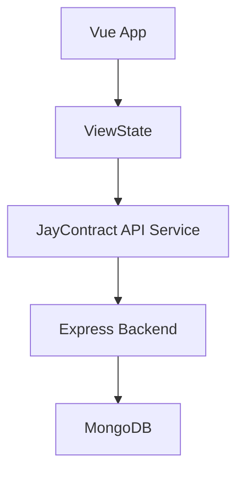

# Design Log #0002 - Vue.js Frontend Implementation

## Background
The backend CRUD API for the helpdesk system is fully functional and tested. We now need a user interface to interact with this API. The user has selected Vue.js as the frontend framework.

## Problem
Currently, there is no frontend application to consume the Helpdesk REST API. We need to implement:
1. A Vue.js application setup (using Vite).
2. A user interface to display a list of all helpdesk responses.
3. Forms to create, update, and delete helpdesk responses.
4. Proper state management (`ViewState`) and API integration layer (`JayContract`).

## Questions and Answers
1. **Q: Should we use TypeScript for the Vue frontend?**
   - **A:** Yes. The Jay Framework Project Rules specify that this is a TypeScript project with heavy type usage. We will initialize the Vue project with TypeScript support.
2. **Q: Where should the frontend code reside?**
   - **A:** The user requested a `client` folder. We will use `client/`.
3. **Q: How will we handle styling?**
   - **A:** We'll stick to scoped Vanilla CSS in Vue Single-File Components (SFCs) to maintain simplicity and flexibility.
4. **Q: What is the state management approach?**
   - **A:** We will use Vue 3's Composition API with `ref` and `reactive` to manage local `ViewState`.

## Design

### API Integration (JayContract)
We will create a service layer (`src/services/api.ts`) to handle all communications with the backend. This acts as the `JayContract`.

| Method | Endpoint | Description |
|---|---|---|
| `GET` | `/responses` | Fetch all helpdesk responses |
| `POST` | `/responses` | Create a new response |
| `GET` | `/responses/:id` | Fetch a single response |
| `PUT` | `/responses/:id` | Update an existing response |
| `DELETE` | `/responses/:id` | Delete a response |

### State Management (ViewState)
The primary `ViewState` for the main component will track:
- `responses`: Array of `HelpdeskContract` objects.
- `isLoading`: Boolean for loading states.
- `error`: String for error messages.
- `currentEdit`: The response currently being edited or created.

### Architecture Diagram

## Implementation Plan

### Phase 1: Setup
1. Scaffold a new Vue 3 + TypeScript application using Vite in a `client` directory.
2. Install necessary dependencies (e.g., `axios` for HTTP requests).

### Phase 2: Contracts and API Layer
1. Define the `HelpdeskContract` TypeScript interface (`src/types/index.ts`).
2. Implement the `JayContract` API service using `axios` (`src/services/api.ts`).

### Phase 3: UI Components
1. Create `ResponseList.vue` to display all entries in a table.
2. Create `AddResponse.vue` for creating new entries.
3. Create `EditResponse.vue` for updating existing entries.

### Phase 4: State Integration
1. Tie the components together in `App.vue`.

## Implementation Results
- [ ] Phase 1: Setup
- [ ] Phase 2: Contracts and API Layer
- [ ] Phase 3: UI Components
- [ ] Phase 4: State Integration
