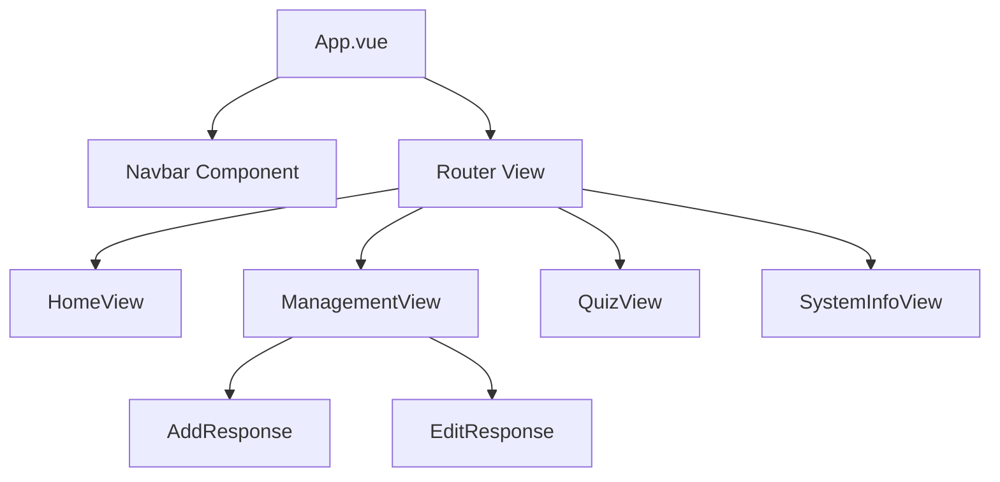

# Design Log #0003 - Staff Training Quiz & Navigation

## Background
To elevate the Helpdesk application from "Satisfactory" to "Excellent", we are implementing advanced features: a Staff Training Quiz and a multi-page navigation system using Vue Router.

## Problem
1. The application is currently a single-page interface, which is difficult to navigate as it grows.
2. The mandatory "Staff Training Quiz" and "System Info" features are missing.
3. The backend lacks an efficient way to fetch a random record for the quiz logic.

## Questions and Answers
1. **Q: How should the quiz validation work?**
   - **A:** The system will fetch a random issue and display the `issueCode`. The user will input their predicted `response`. We will compare the trimmed, case-insensitive strings for validation.
2. **Q: Should the Management page handle both Add and Edit?**
   - **A:** Yes, the `ManagementView.vue` will use the existing `AddResponse` and `EditResponse` components to manage the state, providing a unified admin interface.
3. **Q: What information should "System Info" display?**
   - **A:** It will display metadata about the project: Version, Last Updated, Total records in DB (fetched via a new count endpoint or derived from the list), and the Tech Stack used.

## Design

### Backend Extensions
- `GET /responses/random`: Returns a single random document from the `responses` collection.

### Frontend Routing (Vue Router)
| Path | View | Description |
|---|---|---|
| `/` | `HomeView.vue` | Dashboard displaying the response table. |
| `/management` | `ManagementView.vue` | Interface for adding/editing helpdesk responses. |
| `/quiz` | `QuizView.vue` | Interactive training tool for staff. |
| `/info` | `SystemInfoView.vue` | General system information and statistics. |

### Component Hierarchy


## Implementation Plan

### Phase 1: Backend "Random" & "Count" Endpoints
1. Add `get_random_response` and `get_count` to `api/controllers/helpdeskController.js`.
2. Register routes: `GET /responses/random` and `GET /responses/count`.
3. Verify with tests.

### Phase 2: Vue Router Setup
1. Install `vue-router`.
2. Configure `client/src/router/index.ts`.
3. Refactor `App.vue` logic into `HomeView.vue` and `ManagementView.vue`.
4. Create a global `Navbar.vue` component.

### Phase 3: Higher Mark Features Implementation
1. **Quiz:** Implement `QuizView.vue` with "Next Question" logic.
2. **System Info:** Implement `SystemInfoView.vue` displaying DB stats.

## Examples

### ✅ Good: Random Document Fetch (Mongoose)
```javascript
exports.get_random_response = async (req, res) => {
    const count = await Helpdesk.countDocuments();
    const random = Math.floor(Math.random() * count);
    const response = await Helpdesk.findOne().skip(random);
    res.json(response);
};
```

## Implementation Results
- [x] Phase 1: Backend Extensions (Random & Count endpoints)
- [x] Phase 2: Vue Router Setup (Home, Management, Quiz, Info routes)
- [x] Phase 3: Higher Mark Features (Quiz logic and System Info page)

## Summary of Deviations
1. **Backend Tests:** Added 2 new tests to `api/tests/helpdesk.test.js` to ensure the "Excellent" grade requirements for the random/count logic are fully verified.
2. **Quiz Logic:** Implemented a trimmed, case-insensitive comparison for quiz answers to provide a more user-friendly experience.
3. **Architecture:** Decided to keep the quiz logic purely functional (fetch-and-check) rather than adding a dedicated "Score" collection, keeping the system focused and lean.
